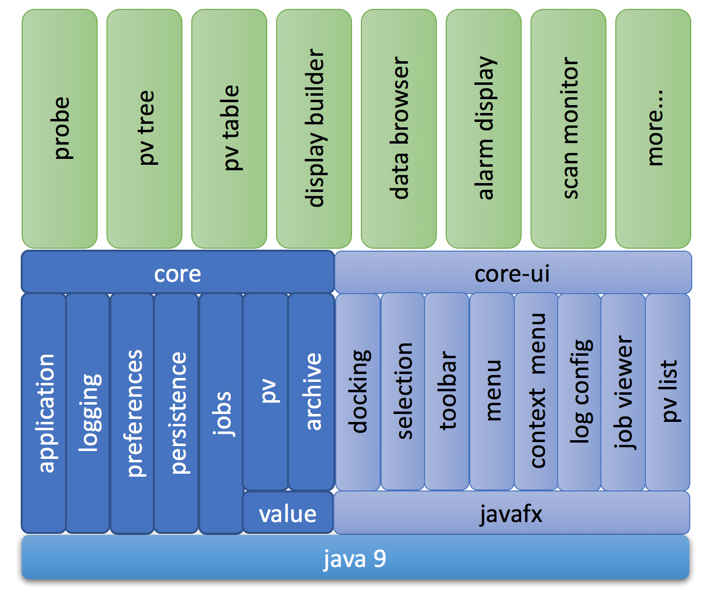

Architecture
============

    Phoebus Architecture

The fundamental phoebus architecture consists of basic *core* modules
and user-iterface related *core-ui* modules, all based on the latest
Java technology, which at this time is Java 9.

 * core/applications
 * core/logging
 * core/preferences
 * core/persistence
 * core/jobs
 * core/pv
 * core/archive
 * core-ui/docking
 * core-ui/selection
 * core-ui/toolbar
 * core-ui/menu
 * core-ui/context menu
 * core-ui/logging configuration
 * core-ui/job viewer
 * core-ui/pv list

